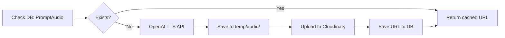
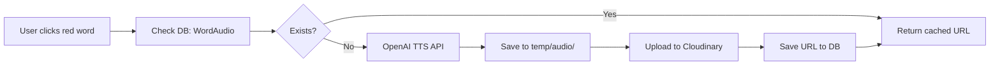
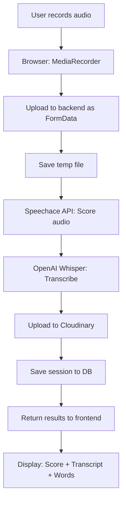

# 🎯 PROMPT PRACTICE - PRONUNCIATION SCORING SYSTEM
## Architecture & Flow Documentation

---

## 📋 TABLE OF CONTENTS
1. [System Overview](#system-overview)
2. [Technology Stack](#technology-stack)
3. [Database Schema](#database-schema)
4. [API Integration](#api-integration)
5. [Audio Pipeline](#audio-pipeline)
6. [Frontend Flow](#frontend-flow)
7. [Backend Flow](#backend-flow)
8. [Storage Strategy](#storage-strategy)
9. [Implementation Phases](#implementation-phases)
10. [Testing Strategy](#testing-strategy)

---

## 1. SYSTEM OVERVIEW

### 🎬 User Journey
```
User clicks "Prompt Practice" 
  → Sees Prompt (full-width centered)
  → Clicks Mic → Recording starts (44s countdown)
  → User speaks or clicks stop manually
  → Loading screen ("Đang chấm điểm...")
  → Results displayed (2-column layout):
     [Left: Prompt] [Right: Results Panel]
        ├─ Transcript với border cam
        ├─ Pronunciation Score (75/100)
        ├─ Word badges (green/red based on score)
        └─ Click từ đỏ → Tooltip chi tiết
```

### 🎯 Core Features
1. **16 Progressive Prompts** (7-25 words, increasing difficulty)
2. **44-second Recording** with countdown timer
3. **Real-time Scoring** using Speechace API
4. **Audio Generation** via OpenAI TTS
5. **Cloud Storage** on Cloudinary
6. **Word-level Analysis** với tooltip chi tiết

---

## 2. TECHNOLOGY STACK

### Frontend (React + TypeScript)
```typescript
- React 18.x
- TypeScript 5.x
- CSS Modules (co-location pattern)
- Lucide Icons (Mic, Square, Loader2, Play)
- MediaRecorder API (browser recording)
```

### Backend (Node.js + Express + TypeScript)
```typescript
- Node.js 18+ / Express 4.x
- TypeScript
- Mongoose (MongoDB ORM)
- Multer (file upload handling)
- Cloudinary SDK (v1.40+)
```

### External APIs
| Service | Purpose | Pricing |
|---------|---------|---------|
| **OpenAI Whisper** | Speech-to-Text (STT) | $0.006/minute |
| **OpenAI TTS** | Text-to-Speech | $15/1M chars |
| **Speechace** | Pronunciation Scoring | API credits based |
| **Cloudinary** | Audio Storage | Free tier: 25GB |

### Database (MongoDB)
- Collections: `PromptAudio`, `WordAudio`, `UserPracticeSession`

---

## 3. DATABASE SCHEMA

### Collection 1: `PromptAudio` (Cache audio chuẩn cho 16 prompts)

```typescript
interface PromptAudio {
  _id: ObjectId;
  promptIndex: number;           // 0-15
  promptText: string;             // Original text
  audioUrl: string;               // Cloudinary URL
  audioPublicId: string;          // Cloudinary public_id
  duration: number;               // seconds
  voice: string;                  // 'alloy' | 'echo' | ...
  generatedAt: Date;
  format: string;                 // 'mp3'
}

// Index: promptIndex (unique)
```

**Sample Document:**
```json
{
  "_id": "67abc123...",
  "promptIndex": 0,
  "promptText": "I like to travel around the world",
  "audioUrl": "https://res.cloudinary.com/.../prompt-0.mp3",
  "audioPublicId": "prompts-audio/prompt-0",
  "duration": 3.2,
  "voice": "alloy",
  "generatedAt": "2026-01-14T10:30:00Z",
  "format": "mp3"
}
```

---

### Collection 2: `WordAudio` (Cache audio từng từ riêng lẻ)

```typescript
interface WordAudio {
  _id: ObjectId;
  word: string;                   // Lowercase normalized
  audioUrl: string;               // Cloudinary URL
  audioPublicId: string;
  duration: number;
  voice: string;
  generatedAt: Date;
  timesUsed: number;              // Track popularity
  format: string;
}

// Index: word (unique)
```

**Sample Document:**
```json
{
  "_id": "67def456...",
  "word": "around",
  "audioUrl": "https://res.cloudinary.com/.../around.mp3",
  "audioPublicId": "words-audio/around",
  "duration": 0.8,
  "voice": "alloy",
  "generatedAt": "2026-01-14T10:35:00Z",
  "timesUsed": 15,
  "format": "mp3"
}
```

---

### Collection 3: `UserPracticeSession` (Lưu lịch sử luyện tập của user)

```typescript
interface UserPracticeSession {
  _id: ObjectId;
  userId: ObjectId;               // Ref to User collection
  promptIndex: number;            // Which prompt (0-15)
  userAudioUrl: string;           // User's recording on Cloudinary
  userAudioPublicId: string;
  transcript: string;             // Kết quả STT từ Whisper
  overallScore: number;           // 0-100
  wordScores: WordScore[];        // Chi tiết từng từ
  completedAt: Date;
  recordingDuration: number;      // seconds
}

interface WordScore {
  word: string;
  score: number;                  // 0-100
  startTime: number;              // seconds (from Speechace)
  endTime: number;                // seconds
  phoneScores: PhoneScore[];      // Chi tiết âm vị
}

interface PhoneScore {
  phone: string;                  // 'eh', 'r', 'aw', 'n', 'd'
  soundMostLike: string;          // Âm thực tế user đọc
  score: number;                  // 0-100
}

// Indexes: 
// - userId + promptIndex (compound)
// - userId + completedAt (for history)
```

**Sample Document:**
```json
{
  "_id": "67ghi789...",
  "userId": "67user123...",
  "promptIndex": 0,
  "userAudioUrl": "https://res.cloudinary.com/.../user-123-prompt-0.mp3",
  "userAudioPublicId": "user-recordings/user-123/prompt-0-1736851200",
  "transcript": "I like tu travel arund the word",
  "overallScore": 75,
  "wordScores": [
    {
      "word": "I",
      "score": 100,
      "startTime": 0.0,
      "endTime": 0.3,
      "phoneScores": [
        { "phone": "ai", "soundMostLike": "ai", "score": 100 }
      ]
    },
    {
      "word": "arund",
      "score": 35,
      "startTime": 2.1,
      "endTime": 2.8,
      "phoneScores": [
        { "phone": "ə", "soundMostLike": "ə", "score": 90 },
        { "phone": "r", "soundMostLike": "r", "score": 80 },
        { "phone": "aw", "soundMostLike": "u", "score": 20 },
        { "phone": "n", "soundMostLike": "n", "score": 95 },
        { "phone": "d", "soundMostLike": "", "score": 0 }
      ]
    }
  ],
  "completedAt": "2026-01-14T11:00:00Z",
  "recordingDuration": 4.2
}
```

---

## 4. API INTEGRATION

### Speechace API Configuration

**Endpoint:** `https://api2.speechace.com`  
**Region:** AP Southeast (Singapore)  
**Product Key:** `10aVYSlQ02QoQfzbzSuMFh%2FLijulCOxb%2Fjf4upG2nDu%2Fetq3VLi1BLDEfc9obrSNVofw09vJwM0blfjqUrz1JgCIJr9%2FXfxvv4A1I19EZtR%2FlnKbmlzdF%2Fokj2qDEM4G`

**API Request Structure:**
```bash
POST https://api2.speechace.com/api/scoring/text/v0.5/json
Content-Type: multipart/form-data

Parameters:
- key: <product_key>
- text: "I like to travel around the world"
- user_audio_file: <audio_file.mp3>
- dialect: "en-us"
- user_id: <user_id>
```

**API Response Structure:**
```json
{
  "status": "success",
  "text_score": {
    "quality_score": 75,
    "fluency_score": 70,
    "pronunciation_score": 80,
    "words_score_list": [
      {
        "word": "around",
        "quality_score": 35,
        "start_offset": 2100,  // milliseconds
        "end_offset": 2800,
        "phone_score_list": [
          {
            "phone": "ə",
            "sound_most_like": "ə",
            "quality_score": 90
          },
          {
            "phone": "aw",
            "sound_most_like": "u",
            "quality_score": 20,
            "stress_level": 1
          }
        ]
      }
    ]
  }
}
```

**Key Fields:**
- `start_offset` / `end_offset`: Timestamp (ms) để cắt audio
- `phone_score_list`: Chi tiết từng âm vị (syllable)
- `sound_most_like`: Âm thực tế user đọc (để hiển thị "Sound like k")

---

### OpenAI TTS API

**Existing Implementation:**
- File: `backend/src/services/ttsService.ts`
- Model: `tts-1` (fast) or `tts-1-hd` (high quality)
- Voices: alloy, echo, fable, onyx, nova, shimmer
- Output: MP3 format
- Max Length: 4096 characters

**Function Signature:**
```typescript
async textToSpeech(
  text: string,
  voice: 'alloy' | 'echo' | 'fable' | 'onyx' | 'nova' | 'shimmer' = 'alloy',
  speed: number = 1.0
): Promise<string>  // Returns local file path
```

**Current Usage:** Voice chat feature đã sử dụng TTS service này.

---

### Cloudinary Upload Service

**Existing Implementation:**
- File: `backend/src/services/cloudinaryService.ts`
- Resource Type: `video` (for audio files)
- Format: MP3
- Auto-conversion: Yes

**Function Signature:**
```typescript
async uploadAudio(
  filePath: string,
  options?: {
    folder?: string;
    publicId?: string;
    userId?: string;
    sessionId?: string;
  }
): Promise<{
  url: string;
  secureUrl: string;
  publicId: string;
  format: string;
  duration: number;
  bytes: number;
}>
```

**Folder Structure on Cloudinary:**
```
english-learning/
├── prompts-audio/
│   ├── prompt-0.mp3
│   ├── prompt-1.mp3
│   └── ... (16 files)
├── words-audio/
│   ├── hello.mp3
│   ├── world.mp3
│   └── ... (cache theo từ)
└── user-recordings/
    ├── user-{userId}/
    │   ├── prompt-0-{timestamp}.mp3
    │   └── prompt-1-{timestamp}.mp3
```

---

## 5. AUDIO PIPELINE

### Pipeline 1: Generate Prompt Audio (One-time for each prompt)



**Implementation:**
```typescript
// backend/src/services/promptAudioService.ts
async getOrGeneratePromptAudio(promptIndex: number, promptText: string): Promise<string> {
  // 1. Check cache in DB
  const cached = await PromptAudio.findOne({ promptIndex });
  if (cached) return cached.audioUrl;
  
  // 2. Generate via TTS
  const localPath = await ttsService.textToSpeech(promptText, 'alloy', 1.0);
  
  // 3. Upload to Cloudinary
  const upload = await cloudinaryService.uploadAudio(localPath, {
    folder: 'prompts-audio',
    publicId: `prompt-${promptIndex}`
  });
  
  // 4. Save to DB
  await PromptAudio.create({
    promptIndex,
    promptText,
    audioUrl: upload.secureUrl,
    audioPublicId: upload.publicId,
    duration: upload.duration,
    voice: 'alloy',
    format: 'mp3'
  });
  
  // 5. Clean up temp file
  await fs.promises.unlink(localPath);
  
  return upload.secureUrl;
}
```

---

### Pipeline 2: Generate Word Audio (On-demand with cache)



**Implementation:**
```typescript
// backend/src/services/wordAudioService.ts
async getOrGenerateWordAudio(word: string): Promise<string> {
  const normalizedWord = word.toLowerCase().trim();
  
  // 1. Check cache
  const cached = await WordAudio.findOne({ word: normalizedWord });
  if (cached) {
    // Increment usage counter
    await WordAudio.updateOne(
      { word: normalizedWord },
      { $inc: { timesUsed: 1 } }
    );
    return cached.audioUrl;
  }
  
  // 2. Generate
  const localPath = await ttsService.textToSpeech(normalizedWord, 'alloy', 0.9);
  
  // 3. Upload
  const upload = await cloudinaryService.uploadAudio(localPath, {
    folder: 'words-audio',
    publicId: `word-${normalizedWord}`
  });
  
  // 4. Save
  await WordAudio.create({
    word: normalizedWord,
    audioUrl: upload.secureUrl,
    audioPublicId: upload.publicId,
    duration: upload.duration,
    voice: 'alloy',
    format: 'mp3',
    timesUsed: 1
  });
  
  // 5. Clean up
  await fs.promises.unlink(localPath);
  
  return upload.secureUrl;
}
```

---

### Pipeline 3: User Recording → Scoring → Storage



**Detailed Flow:**
```typescript
// backend/src/services/pronunciationScoringService.ts
async scoreUserRecording(
  userId: string,
  promptIndex: number,
  promptText: string,
  audioFile: Express.Multer.File
): Promise<ScoringResult> {
  
  // 1. Call Speechace API for pronunciation scoring
  const speechaceResult = await this.callSpeechaceAPI(
    audioFile.path,
    promptText,
    userId
  );
  
  // 2. Call Whisper API for transcription
  const transcript = await whisperService.transcribe(audioFile.path);
  
  // 3. Upload user audio to Cloudinary
  const cloudinaryResult = await cloudinaryService.uploadAudio(audioFile.path, {
    folder: 'user-recordings',
    publicId: `user-${userId}-prompt-${promptIndex}-${Date.now()}`,
    userId,
    sessionId: `session-${Date.now()}`
  });
  
  // 4. Parse and format results
  const wordScores = this.parseWordScores(speechaceResult.text_score.words_score_list);
  
  // 5. Save to database
  await UserPracticeSession.create({
    userId,
    promptIndex,
    userAudioUrl: cloudinaryResult.secureUrl,
    userAudioPublicId: cloudinaryResult.publicId,
    transcript,
    overallScore: speechaceResult.text_score.quality_score,
    wordScores,
    recordingDuration: cloudinaryResult.duration
  });
  
  // 6. Clean up temp file
  await fs.promises.unlink(audioFile.path);
  
  return {
    transcript,
    overallScore: speechaceResult.text_score.quality_score,
    wordScores
  };
}
```

---

## 6. FRONTEND FLOW

### State Management

```typescript
// PromptPractice.tsx
const [currentPromptIndex, setCurrentPromptIndex] = useState(0);
const [userTranscript, setUserTranscript] = useState<string>('');
const [pronunciationScore, setPronunciationScore] = useState<number>(0);
const [wordScores, setWordScores] = useState<WordScore[]>([]);
const [showResult, setShowResult] = useState(false);

// Recording states
const [isRecording, setIsRecording] = useState(false);
const [countdown, setCountdown] = useState(44);
const [isLoading, setIsLoading] = useState(false);
const [mediaRecorder, setMediaRecorder] = useState<MediaRecorder | null>(null);

// Tooltip state
const [selectedWord, setSelectedWord] = useState<WordScore | null>(null);
const [tooltipPosition, setTooltipPosition] = useState<{x: number, y: number} | null>(null);
```

---

### Recording Flow

```typescript
// 1. Start Recording
const handleStartRecording = async () => {
  try {
    const stream = await navigator.mediaDevices.getUserMedia({ audio: true });
    const recorder = new MediaRecorder(stream, {
      mimeType: 'audio/webm;codecs=opus'  // Browser compatible
    });
    
    const chunks: BlobPart[] = [];
    
    recorder.ondataavailable = (e) => {
      chunks.push(e.data);
    };
    
    recorder.onstop = async () => {
      const audioBlob = new Blob(chunks, { type: 'audio/webm' });
      await handleUploadAndScore(audioBlob);
      
      // Stop all tracks
      stream.getTracks().forEach(track => track.stop());
    };
    
    recorder.start();
    setMediaRecorder(recorder);
    setIsRecording(true);
    setCountdown(44);
    
  } catch (error) {
    console.error('Failed to start recording:', error);
    alert('Không thể truy cập microphone');
  }
};

// 2. Stop Recording (manual or auto)
const handleStopRecording = () => {
  if (mediaRecorder && mediaRecorder.state === 'recording') {
    mediaRecorder.stop();
    setIsRecording(false);
  }
};

// 3. Upload and Score
const handleUploadAndScore = async (audioBlob: Blob) => {
  setIsLoading(true);
  
  try {
    const formData = new FormData();
    formData.append('audio', audioBlob, 'recording.webm');
    formData.append('promptIndex', currentPromptIndex.toString());
    formData.append('promptText', PROMPTS[currentPromptIndex]);
    
    const response = await fetch('/api/pronunciation/score', {
      method: 'POST',
      headers: {
        'Authorization': `Bearer ${token}`
      },
      body: formData
    });
    
    const result = await response.json();
    
    // Update UI
    setUserTranscript(result.transcript);
    setPronunciationScore(result.overallScore);
    setWordScores(result.wordScores);
    setShowResult(true);
    
  } catch (error) {
    console.error('Scoring failed:', error);
    alert('Không thể chấm điểm. Vui lòng thử lại.');
  } finally {
    setIsLoading(false);
  }
};
```

---

### Countdown Timer

```typescript
useEffect(() => {
  if (isRecording && countdown > 0) {
    const timer = setTimeout(() => {
      setCountdown(countdown - 1);
    }, 1000);
    
    return () => clearTimeout(timer);
  } else if (isRecording && countdown === 0) {
    // Auto stop when time's up
    handleStopRecording();
  }
}, [isRecording, countdown]);
```

---

### Word Click Handler + Tooltip

```typescript
const handleWordClick = async (wordScore: WordScore) => {
  if (wordScore.score >= 70) return;  // Only show tooltip for incorrect words
  
  setSelectedWord(wordScore);
  
  // Fetch word audio URL (standard pronunciation)
  const correctWordAudio = await fetch(
    `/api/pronunciation/word-audio/${wordScore.word}`
  ).then(res => res.json());
  
  // User's audio segment (calculated from timestamps)
  const userWordAudioUrl = await generateUserWordSegment(
    userAudioUrl,
    wordScore.startTime,
    wordScore.endTime
  );
  
  setSelectedWord({
    ...wordScore,
    correctAudioUrl: correctWordAudio.url,
    userAudioUrl: userWordAudioUrl
  });
};

// Generate audio segment from full recording
const generateUserWordSegment = async (
  fullAudioUrl: string,
  startTime: number,
  endTime: number
): Promise<string> => {
  // Option 1: Client-side using Web Audio API
  const audioContext = new AudioContext();
  const response = await fetch(fullAudioUrl);
  const arrayBuffer = await response.arrayBuffer();
  const audioBuffer = await audioContext.decodeAudioData(arrayBuffer);
  
  // Extract segment
  const sampleRate = audioBuffer.sampleRate;
  const startSample = Math.floor(startTime * sampleRate);
  const endSample = Math.floor(endTime * sampleRate);
  const length = endSample - startSample;
  
  const segment = audioContext.createBuffer(
    audioBuffer.numberOfChannels,
    length,
    sampleRate
  );
  
  for (let channel = 0; channel < audioBuffer.numberOfChannels; channel++) {
    const sourceData = audioBuffer.getChannelData(channel);
    const segmentData = segment.getChannelData(channel);
    segmentData.set(sourceData.subarray(startSample, endSample));
  }
  
  // Convert to blob and create URL
  const offlineContext = new OfflineAudioContext(
    segment.numberOfChannels,
    length,
    sampleRate
  );
  const source = offlineContext.createBufferSource();
  source.buffer = segment;
  source.connect(offlineContext.destination);
  source.start();
  
  const rendered = await offlineContext.startRendering();
  
  // Option 2: Server-side using FFmpeg (more reliable)
  // POST /api/pronunciation/extract-segment
  // { audioUrl, startTime, endTime }
  
  return segmentUrl;
};
```

---

### Tooltip Component

```typescript
// components/WordDetailTooltip.tsx
interface WordDetailTooltipProps {
  wordScore: WordScore;
  correctAudioUrl: string;
  userAudioUrl: string;
  position: { x: number, y: number };
  onClose: () => void;
}

const WordDetailTooltip: React.FC<WordDetailTooltipProps> = ({
  wordScore,
  correctAudioUrl,
  userAudioUrl,
  position,
  onClose
}) => {
  const [playingCorrect, setPlayingCorrect] = useState(false);
  const [playingUser, setPlayingUser] = useState(false);
  
  const playAudio = (url: string, setPlaying: (val: boolean) => void) => {
    const audio = new Audio(url);
    setPlaying(true);
    audio.onended = () => setPlaying(false);
    audio.play();
  };
  
  return (
    <div 
      className={styles.tooltip}
      style={{
        position: 'absolute',
        top: position.y + 40,
        left: position.x,
        transform: 'translateX(-50%)'
      }}
    >
      <div className={styles.header}>
        <h4>Bạn đọc: "{wordScore.word}" ❌ ({wordScore.score} điểm)</h4>
        <button onClick={onClose}>×</button>
      </div>
      
      <div className={styles.audioButtons}>
        <button onClick={() => playAudio(correctAudioUrl, setPlayingCorrect)}>
          {playingCorrect ? '⏸️' : '🔊'} Nghe chuẩn
        </button>
        <button onClick={() => playAudio(userAudioUrl, setPlayingUser)}>
          {playingUser ? '⏸️' : '🔊'} Giọng bạn
        </button>
      </div>
      
      <table className={styles.phoneTable}>
        <thead>
          <tr>
            <th>Syllable</th>
            <th>Phone</th>
            <th>Score</th>
          </tr>
        </thead>
        <tbody>
          {wordScore.phoneScores.map((phone, i) => (
            <tr key={i} className={phone.score < 70 ? styles.error : styles.correct}>
              <td>{wordScore.word}</td>
              <td>{phone.phone}</td>
              <td>
                {phone.score >= 70 
                  ? <span className={styles.good}>Good</span>
                  : <span className={styles.bad}>Sound like {phone.soundMostLike}</span>
                }
              </td>
            </tr>
          ))}
        </tbody>
      </table>
    </div>
  );
};
```

---

## 7. BACKEND FLOW

### API Endpoints

#### `POST /api/pronunciation/score`
Score user's pronunciation recording.

**Request:**
```typescript
Content-Type: multipart/form-data
Authorization: Bearer <token>

Body:
- audio: File (webm/mp3)
- promptIndex: number
- promptText: string
```

**Response:**
```json
{
  "success": true,
  "data": {
    "transcript": "I like tu travel arund the word",
    "overallScore": 75,
    "wordScores": [
      {
        "word": "around",
        "score": 35,
        "startTime": 2.1,
        "endTime": 2.8,
        "phoneScores": [...]
      }
    ],
    "sessionId": "67ghi789..."
  }
}
```

---

#### `GET /api/pronunciation/prompt-audio/:promptIndex`
Get or generate audio for a specific prompt.

**Response:**
```json
{
  "success": true,
  "data": {
    "audioUrl": "https://res.cloudinary.com/.../prompt-0.mp3",
    "duration": 3.2,
    "cached": true
  }
}
```

---

#### `GET /api/pronunciation/word-audio/:word`
Get or generate audio for a specific word.

**Response:**
```json
{
  "success": true,
  "data": {
    "audioUrl": "https://res.cloudinary.com/.../around.mp3",
    "duration": 0.8,
    "cached": true
  }
}
```

---

#### `POST /api/pronunciation/extract-segment`
Extract audio segment from full recording (for word-level playback).

**Request:**
```json
{
  "audioUrl": "https://res.cloudinary.com/.../user-123-prompt-0.mp3",
  "startTime": 2.1,
  "endTime": 2.8,
  "word": "around"
}
```

**Response:**
```json
{
  "success": true,
  "data": {
    "segmentUrl": "https://res.cloudinary.com/.../segment-around-1234.mp3",
    "duration": 0.7
  }
}
```

**Implementation (using FFmpeg):**
```typescript
// backend/src/services/audioSegmentService.ts
import ffmpeg from 'fluent-ffmpeg';
import { promises as fs } from 'fs';
import path from 'path';

async extractAudioSegment(
  audioUrl: string,
  startTime: number,
  endTime: number
): Promise<string> {
  // 1. Download full audio from Cloudinary
  const response = await fetch(audioUrl);
  const buffer = await response.arrayBuffer();
  const tempInputPath = path.join(__dirname, '../../temp/audio', `input-${Date.now()}.mp3`);
  await fs.writeFile(tempInputPath, Buffer.from(buffer));
  
  // 2. Extract segment using FFmpeg
  const duration = endTime - startTime;
  const tempOutputPath = path.join(__dirname, '../../temp/audio', `segment-${Date.now()}.mp3`);
  
  await new Promise((resolve, reject) => {
    ffmpeg(tempInputPath)
      .setStartTime(startTime)
      .setDuration(duration)
      .output(tempOutputPath)
      .on('end', resolve)
      .on('error', reject)
      .run();
  });
  
  // 3. Upload segment to Cloudinary
  const upload = await cloudinaryService.uploadAudio(tempOutputPath, {
    folder: 'audio-segments',
    publicId: `segment-${Date.now()}`
  });
  
  // 4. Clean up
  await fs.unlink(tempInputPath);
  await fs.unlink(tempOutputPath);
  
  return upload.secureUrl;
}
```

---

#### `GET /api/pronunciation/history/:userId`
Get user's practice history.

**Response:**
```json
{
  "success": true,
  "data": [
    {
      "promptIndex": 0,
      "overallScore": 75,
      "completedAt": "2026-01-14T11:00:00Z",
      "transcript": "I like tu travel arund the word"
    },
    {
      "promptIndex": 1,
      "overallScore": 82,
      "completedAt": "2026-01-14T11:05:00Z"
    }
  ]
}
```

---

## 8. STORAGE STRATEGY

### Cloudinary Folder Organization

```
english-learning/
├── prompts-audio/          # 16 files only (one per prompt)
│   ├── prompt-0.mp3       (~50KB per file = 800KB total)
│   ├── prompt-1.mp3
│   └── ...
│
├── words-audio/            # Growing cache (most-used words)
│   ├── hello.mp3          (~20KB per word)
│   ├── world.mp3          (estimate: 500 words = 10MB)
│   ├── around.mp3
│   └── ...
│
├── user-recordings/        # User practice sessions
│   ├── user-67abc/
│   │   ├── prompt-0-1736851200.mp3  (~100KB per recording)
│   │   ├── prompt-1-1736851300.mp3
│   │   └── ...
│   └── user-67def/
│       └── ...
│
└── audio-segments/         # Temporary word segments (can be deleted)
    ├── segment-1736851200.mp3  (~10KB per segment)
    └── ...
```

**Storage Estimates:**
- **Prompt Audio**: 16 prompts × 50KB = ~800KB (one-time)
- **Word Audio**: 500 words × 20KB = ~10MB (grows over time)
- **User Recordings**: 100 users × 16 prompts × 100KB = ~160MB
- **Segments**: Can be deleted after 24h to save space

**Total for 100 active users:** ~170MB (well within Cloudinary free tier of 25GB)

---

### Database Indexes

```javascript
// PromptAudio collection
db.promptaudios.createIndex({ promptIndex: 1 }, { unique: true });

// WordAudio collection
db.wordaudios.createIndex({ word: 1 }, { unique: true });
db.wordaudios.createIndex({ timesUsed: -1 });  // For analytics

// UserPracticeSession collection
db.userpracticesessions.createIndex({ userId: 1, promptIndex: 1 });
db.userpracticesessions.createIndex({ userId: 1, completedAt: -1 });
db.userpracticesessions.createIndex({ completedAt: -1 });  // For cleanup
```

---

## 9. IMPLEMENTATION PHASES

### ✅ Phase 1: Basic Recording & UI (COMPLETED)
- [x] 44s countdown timer
- [x] Start/stop recording
- [x] Loading state
- [x] Conditional layout (full-width / 2-column)
- [x] Mock scoring results display

---

### 🔄 Phase 2: Backend Setup (NEXT - PRIORITY 1)

**Week 1: Database & Models**
1. Create Mongoose models:
   - PromptAudio.ts
   - WordAudio.ts
   - UserPracticeSession.ts
2. Add to backend/src/models/
3. Test CRUD operations

**Week 2: Speechace Integration**
1. Create speechaceService.ts
2. Implement API call with proper error handling
3. Parse response and extract word scores + timestamps
4. Test with sample audio files

**Week 3: Audio Generation Pipeline**
1. Create promptAudioService.ts
   - getOrGeneratePromptAudio()
   - Auto-generate on first request
2. Create wordAudioService.ts
   - getOrGenerateWordAudio()
   - Cache popular words
3. Test TTS → Cloudinary pipeline

**Week 4: Main API Endpoints**
1. POST /api/pronunciation/score
   - Handle multipart upload
   - Call Speechace + Whisper
   - Save to DB
   - Return results
2. GET /api/pronunciation/prompt-audio/:index
3. GET /api/pronunciation/word-audio/:word
4. Test full flow end-to-end

---

### 🎯 Phase 3: Advanced Features (PRIORITY 2)

**Week 5-6: Word-level Audio Segments**
1. Install FFmpeg on server
2. Create audioSegmentService.ts
3. POST /api/pronunciation/extract-segment
4. Test segment extraction accuracy

**Week 7: Tooltip Component**
1. Create WordDetailTooltip.tsx
2. Implement positioning logic
3. Add phone score table
4. Add dual audio players (correct + user)

**Week 8: Color Logic Update**
1. Update word badge colors: score >= 70 → green, < 70 → red
2. Remove yellow/warning state
3. Update CSS accordingly

---

### 🚀 Phase 4: Optimization & Polish (PRIORITY 3)

**Week 9: Performance**
1. Implement audio caching strategy
2. Optimize Cloudinary uploads (batch if possible)
3. Add loading states for all async operations
4. Implement request throttling

**Week 10: Error Handling**
1. Add retry logic for API failures
2. User-friendly error messages
3. Fallback mechanisms (if Speechace is down)
4. Logging and monitoring

**Week 11: Testing**
1. Unit tests for services
2. Integration tests for API endpoints
3. E2E tests for user flow
4. Load testing (simulate 100 concurrent users)

**Week 12: Documentation & Deployment**
1. API documentation (Swagger/OpenAPI)
2. User guide
3. Deploy to production
4. Monitor initial usage

---

## 10. TESTING STRATEGY

### Unit Tests

```typescript
// tests/services/speechaceService.test.ts
describe('SpeechaceService', () => {
  it('should parse word scores correctly', () => {
    const mockResponse = { ... };
    const result = speechaceService.parseWordScores(mockResponse);
    expect(result[0].word).toBe('hello');
    expect(result[0].score).toBe(95);
  });
  
  it('should handle API errors gracefully', async () => {
    // Mock failed API call
    await expect(speechaceService.scoreAudio(...)).rejects.toThrow();
  });
});

// tests/services/promptAudioService.test.ts
describe('PromptAudioService', () => {
  it('should return cached audio if exists', async () => {
    const url = await promptAudioService.getOrGeneratePromptAudio(0, 'test');
    expect(url).toContain('cloudinary.com');
  });
  
  it('should generate new audio if not cached', async () => {
    const url = await promptAudioService.getOrGeneratePromptAudio(99, 'new prompt');
    expect(url).toBeTruthy();
  });
});
```

---

### Integration Tests

```typescript
// tests/api/pronunciation.test.ts
describe('POST /api/pronunciation/score', () => {
  it('should score valid audio recording', async () => {
    const formData = new FormData();
    formData.append('audio', audioBlob);
    formData.append('promptIndex', '0');
    formData.append('promptText', 'test');
    
    const response = await request(app)
      .post('/api/pronunciation/score')
      .set('Authorization', `Bearer ${token}`)
      .send(formData)
      .expect(200);
    
    expect(response.body.data.overallScore).toBeGreaterThan(0);
    expect(response.body.data.wordScores).toHaveLength(4);
  });
  
  it('should reject invalid audio format', async () => {
    // Test with invalid file
    await request(app)
      .post('/api/pronunciation/score')
      .send({ audio: 'invalid' })
      .expect(400);
  });
});
```

---

### E2E Tests (Playwright)

```typescript
// e2e/promptPractice.spec.ts
test('user can record and get pronunciation score', async ({ page }) => {
  await page.goto('/chat');
  await page.click('[data-testid="assessment-mode"]');
  await page.click('[data-testid="prompt-practice"]');
  
  // Start recording
  await page.click('[data-testid="mic-button"]');
  await page.waitForSelector('[data-testid="countdown"]');
  
  // Wait 5 seconds
  await page.waitForTimeout(5000);
  
  // Stop recording
  await page.click('[data-testid="mic-button"]');
  
  // Wait for results
  await page.waitForSelector('[data-testid="result-panel"]');
  
  // Check score is displayed
  const score = await page.textContent('[data-testid="pronunciation-score"]');
  expect(parseInt(score!)).toBeGreaterThan(0);
});
```

---

### Load Testing (Artillery)

```yaml
# load-test.yml
config:
  target: 'http://localhost:5000'
  phases:
    - duration: 60
      arrivalRate: 10  # 10 users per second
    - duration: 120
      arrivalRate: 50  # 50 users per second
scenarios:
  - name: "Record and score"
    flow:
      - post:
          url: "/api/pronunciation/score"
          headers:
            Authorization: "Bearer {{token}}"
          formData:
            audio: "@test-audio.mp3"
            promptIndex: "0"
            promptText: "I like to travel around the world"
```

Run: `artillery run load-test.yml`

---

## 🎯 SUCCESS METRICS

1. **Performance:**
   - Audio generation: < 3s per prompt
   - Scoring API response: < 5s
   - Total user flow: < 15s (record → score → display)

2. **Accuracy:**
   - Speechace word-level accuracy: > 90%
   - Timestamp precision: ± 100ms

3. **Storage:**
   - Cloudinary usage: < 1GB for 1000 active users
   - DB size: < 500MB for 10k practice sessions

4. **Reliability:**
   - API uptime: > 99.5%
   - Error rate: < 1%
   - Cache hit rate: > 80% (for word audio)

---

## 📚 REFERENCES

1. **Speechace API Docs:** https://docs.speechace.com/
2. **OpenAI TTS:** https://platform.openai.com/docs/guides/text-to-speech
3. **Cloudinary Audio:** https://cloudinary.com/documentation/audio_transformations
4. **Web Audio API:** https://developer.mozilla.org/en-US/docs/Web/API/Web_Audio_API
5. **FFmpeg Guide:** https://ffmpeg.org/ffmpeg.html

---

## 🔧 ENVIRONMENT VARIABLES

```bash
# backend/.env
OPENAI_API_KEY=sk-...
CLOUDINARY_CLOUD_NAME=your-cloud-name
CLOUDINARY_API_KEY=123456789
CLOUDINARY_API_SECRET=abc...
SPEECHACE_API_KEY=10aVYSlQ02Qo...
SPEECHACE_API_ENDPOINT=https://api2.speechace.com
```

---

## 📝 NOTES

- **Audio Format:** MP3 is chosen for universal compatibility and good compression ratio
- **Caching Strategy:** Aggressive caching for prompts (16 static files) and words (500+ most common)
- **Segments:** Temporary, can be deleted after 24h to save space
- **Security:** All audio URLs are from Cloudinary (secure HTTPS), no direct file system access
- **Scalability:** Cloudinary CDN ensures fast delivery globally

---

**Document Version:** 1.0  
**Created:** 2026-01-14  
**Author:** GitHub Copilot AI  
**Last Updated:** 2026-01-14
